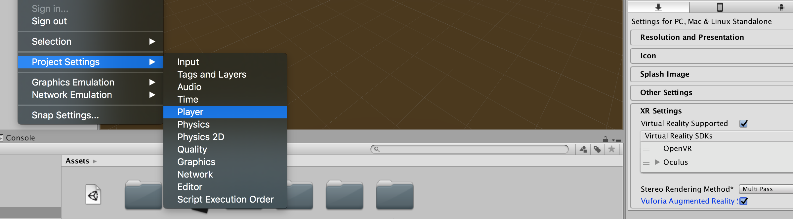
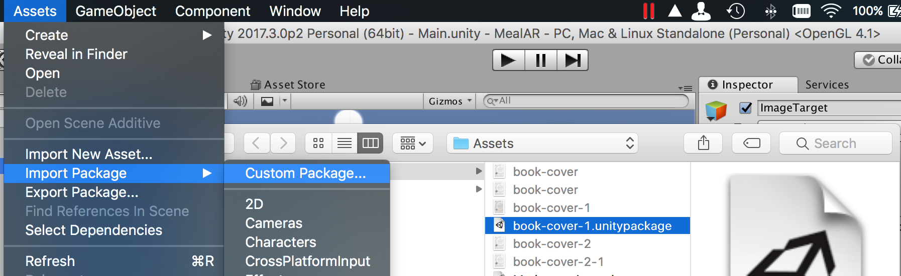
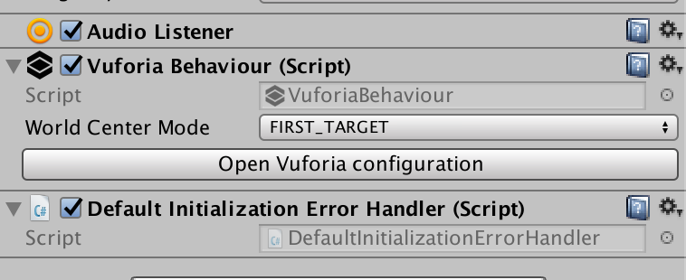
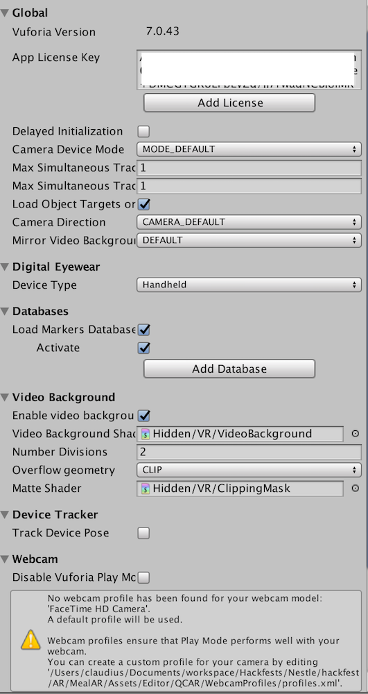

# AR Ramp up - Unity & Vuforia

## Prereqs:

* [Unity Download Assistant](https://unity3d.com/unity/qa/patch-releases?version=2017.3)
* [Vuforia account](https://developer.vuforia.com/)
* [Vuforia AR SDK](https://developer.vuforia.com/downloads/sdk)

## Setup
* Download and install Unity w/ the Vuforia AR Extention

* Setup connections to external SDKS

## Build your first AR App ([Follow this tutorial](https://www.youtube.com/watch?v=YvSrZqP0elQ))

### Updates to tutorial:

#### *Careful to not make your marker too large or too small. Try to scale it to the size of the actual object*

* Enable Vuforia Player Settings

* Enable Vurforia & Add Vurforia AR camera asset to scene

* Create [Target in Vuforia](https://developer.vuforia.com/targetmanager/project/checkDeviceProjectsCreated?dataRequestedForUserId=) & Download for Unity Package

* Import Asset Package to Unity Project

* `ARCamera` settings and configuration

## Unity Tips
* **Center view at object:** Select the object in the Hierarchy view, then put your cursor over the Scene view and press F.
* When doing animations, for rotations 9around Y-axis), need to do a slight rotation first to generate key-frame then the full rotation. Else Unity extrapolates your full rotation from the first-second to the finish.

# Resources

## Good Tutorials

### Videos:
* [**Tutorial on making an Android AR scene**](https://www.youtube.com/watch?v=YvSrZqP0elQ)
* [Unity ARCore Tutorial](https://www.youtube.com/watch?v=bJDEAQADi0U)
* [Open Hello Google ARCore sample project](https://www.youtube.com/watch?v=g6UgzFP36bw)
* [ARCore-101](https://haptic.al/arcore-101-fa6f93d4c003)
* [Introduction to Mobile Augmented Reality Development in Unity](https://programminghistorian.org/lessons/intro-to-augmented-reality-with-unity)
* [**Augmented Reality in Android with Google’s Face API**](https://www.raywenderlich.com/158580/augmented-reality-android-googles-face-api)
* [10mins create a user-defined target AR app](https://www.youtube.com/watch?v=Uoa9Ha4De98)
* [Unity - Move a Cube with the Arrow Keys](https://www.youtube.com/watch?v=sXQI_0ILEW4)
* [**Unity C# Scripting**](https://unity3d.com/learn/tutorials/s/scripting)

### Text:
* [Augmented-Reality-Tutorial-Android](http://www.instructables.com/id/Augmented-Reality-Tutorial-PizzaSalad-Android/)

## Assets
* [Google poly](https://poly.google.com/)
* [Google Tilt brush](https://www.tiltbrush.com/) - [Google blocks](https://vr.google.com/blocks/) - Only available on Vive/Oculus
* Asset store:
	* Lean Touch/Pool/Localization
	* Unity Core
	* Unity Particle Pack
	* Vuforia Core Samples

## Misc
* [Vuforia Tools](https://developer.vuforia.com/downloads/tool)
* [ARToolkit](https://www.artoolkit.org/)
* [**Unity Manual**](https://docs.unity3d.com/Manual/UsingTheEditor.html)
* [User Defined Targets](https://library.vuforia.com/articles/Training/User-Defined-Targets-Guide)
* [**REST in Unity**](https://answers.unity.com/questions/11021/how-can-i-send-and-receive-data-to-and-from-a-url.html)
* [Text Reco Word List](https://developer.vuforia.com/forum/unity/standard-wordlist-download)
* [Text-Tracking - OLD](http://www.himix.lt/augmented-reality/augmented-reality-text-tracking/)
* [Android - DeepLink Application](https://youtu.be/Pxu7i8sWUjQ?t=2m14s) - [StackOverFlow](https://stackoverflow.com/questions/525063/android-respond-to-url-in-intent)
* [Play Audio Clip in Code](https://answers.unity.com/questions/12546/playing-audio-clip.html)

## Environments

* [ARCore - Unity](https://developers.google.com/ar/develop/unity/getting-started)

