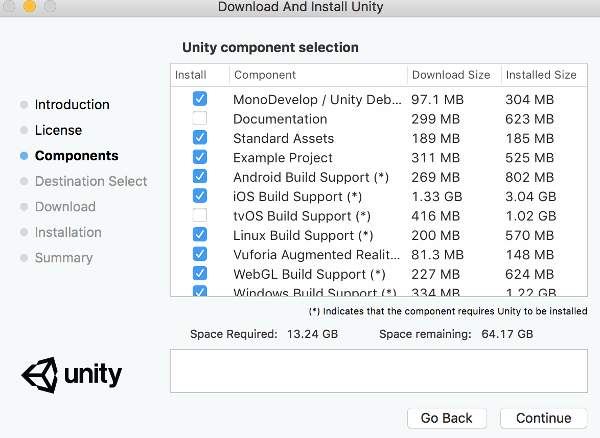
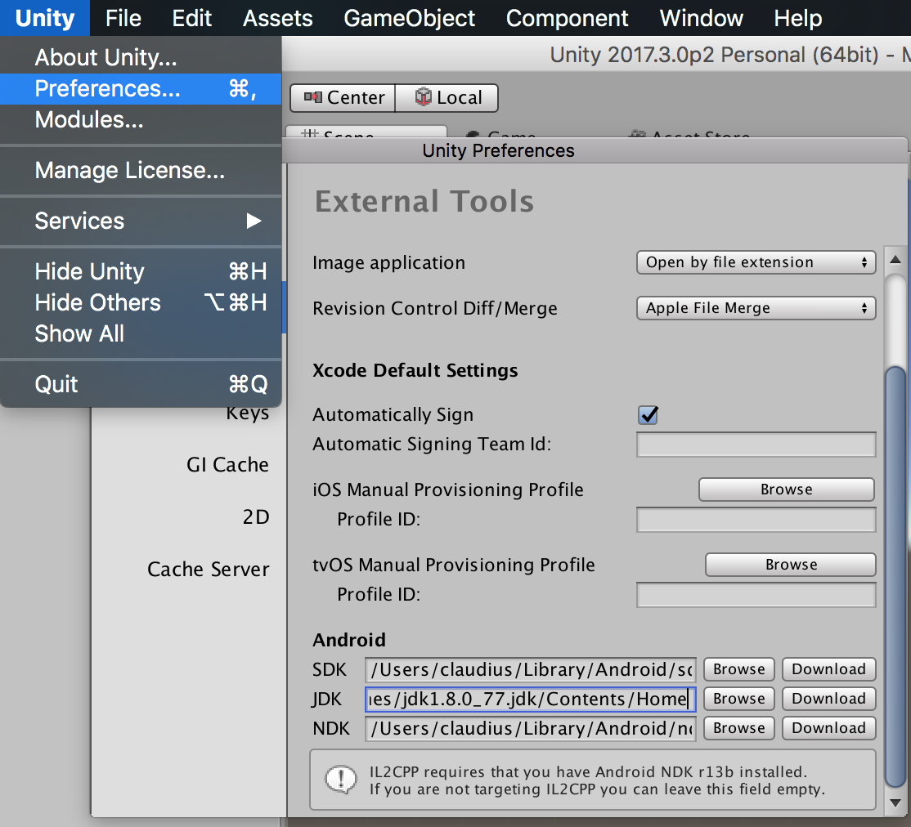
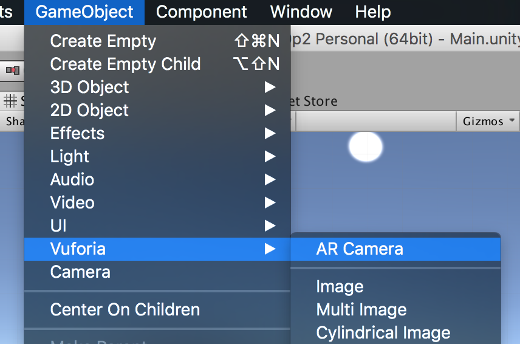

# AR Ramp up

## Prereqs:

* [Unity Download Assistant](https://unity3d.com/unity/qa/patch-releases?version=2017.3)
* [Vuforia account](https://developer.vuforia.com/)
* [Vuforia AR SDK](https://developer.vuforia.com/downloads/sdk)

## Setup
* Download and install Unity w/ the Vuforia AR Extention

* Setup connections to external SDKS

## New Project
* Open up Unity & Create a new project
* Delete current scene objects
* Enable Vurforia & Add Vurforia AR camera asset to scene

# Resources

## Good Tutorials
* [**Tutorial on making an Android AR scene**](https://www.youtube.com/watch?v=YvSrZqP0elQ)
* [Unity ARCore Tutorial](https://www.youtube.com/watch?v=bJDEAQADi0U)
* [Open Hello Google ARCore sample project](https://www.youtube.com/watch?v=g6UgzFP36bw)
* [ARCore-101](https://haptic.al/arcore-101-fa6f93d4c003)
* [Introduction to Mobile Augmented Reality Development in Unity](https://programminghistorian.org/lessons/intro-to-augmented-reality-with-unity)
* [**Augmented Reality in Android with Google’s Face API**](https://www.raywenderlich.com/158580/augmented-reality-android-googles-face-api)

## Assets
* [Google poly](https://poly.google.com/)
* [Google Tilt brush](https://www.tiltbrush.com/) - [Google blocks](https://vr.google.com/blocks/) - Only available on Vive/Oculus

## Misc
* [Vuforia Tools](https://developer.vuforia.com/downloads/tool)
* [ARToolkit](https://www.artoolkit.org/)
* [**Unity Manual**](https://docs.unity3d.com/Manual/UsingTheEditor.html)

## Environments

* [ARCore - Unity](https://developers.google.com/ar/develop/unity/getting-started)

